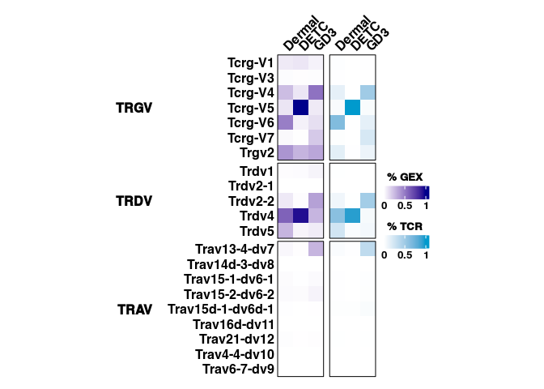
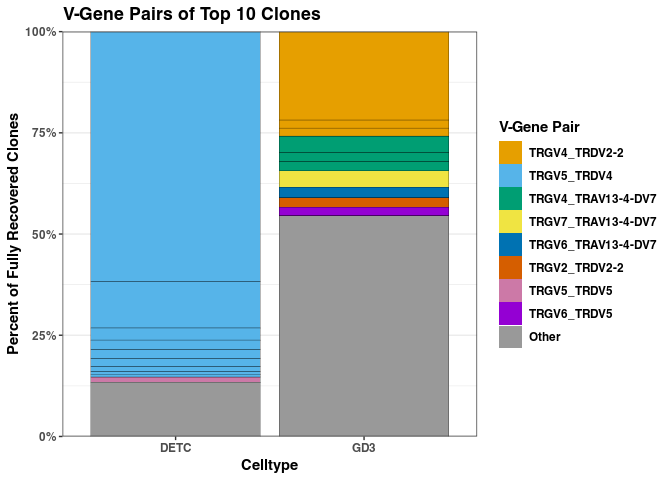

Extended Figure 4
================

## Set up

Load R libraries

``` r
library(tidyverse)
library(glue)
library(ComplexHeatmap)
library(circlize)
library(ggokabeito)

library(reticulate)
use_python("/projects/home/nealpsmith/.conda/envs/updated_pegasus/bin/python")

setwd('/projects/home/ikernin/github_code/sokol_gdt/functions')
source('r_functions.R')
```

Load python packages

``` python

import pegasus as pg
import scanpy as sc
import pandas as pd
import warnings
warnings.filterwarnings('ignore')

import sys
sys.path.append("/projects/home/ikernin/github_code/sokol_gdt/functions")
import python_functions
```

Read in data

``` python
mouse_df = pg.read_input('/projects/home/ikernin/projects/sokol_cameron_sc/github_datasets/github_mouse_df.zarr')
```

## Extended Figure 4a

``` python
# define gene lists
tcrg_genes = ['Tcrg-V1', 'Trgv2', 'Tcrg-V3', 'Tcrg-V4', 'Tcrg-V5', 'Tcrg-V6', 'Tcrg-V7']
trdv_genes = ['Trdv1', 'Trdv4', 'Trdv5', 'Trdv2-1', 'Trdv2-2']
travd_genes = ["Trav13-4-dv7", "Trav15d-1-dv6d-1", "Trav15-1-dv6-1", "Trav15-2-dv6-2",
               "Trav21-dv12", "Trav4-4-dv10", "Trav14d-3-dv8", "Trav6-7-dv9", 'Trav16d-dv11']

def get_gex_expression_perc(df, gene_list, save_name, celltype_col='celltype'):
    celltypes = df.obs[celltype_col].cat.categories
    df_perc = {}
    for ct in celltypes:
        temp_df = df[df.obs['celltype'] == ct].copy()
        perc_dict = {}
        for gene in gene_list:
            if gene in temp_df.var_names:
                perc_dict[gene] = temp_df[:, gene].copy().get_matrix('raw.X').count_nonzero() / temp_df.shape[0]
            else:
                perc_dict[gene] = 0
        df_perc[ct] = dict(zip(gene_list, pd.Series(perc_dict.values())))
    pd.DataFrame(df_perc).transpose().to_csv(save_name)

get_gex_expression_perc(mouse_df, tcrg_genes, '/projects/home/ikernin/projects/sokol_cameron_sc/github_datasets/gex_tcrg_perc_cells.csv')
get_gex_expression_perc(mouse_df, trdv_genes, '/projects/home/ikernin/projects/sokol_cameron_sc/github_datasets/gex_trdv_perc_cells.csv')
get_gex_expression_perc(mouse_df, travd_genes, '/projects/home/ikernin/projects/sokol_cameron_sc/github_datasets/gex_travd_perc_cells.csv')
```

``` r
# read in TCR info per celltype
gd3_df <- read_csv(glue('/projects/home/ikernin/projects/sokol_cameron_sc/github_datasets/gd3_2umi_tcr.csv'), show_col_types = FALSE)
detc_df <- read_csv(glue('/projects/home/ikernin/projects/sokol_cameron_sc/github_datasets/detc_2umi_tcr.csv'), show_col_types = FALSE)
dermal_df <- read_csv(glue('/projects/home/ikernin/projects/sokol_cameron_sc/github_datasets/dermal_2umi_tcr.csv'), show_col_types = FALSE)

# add celltype name to dataframes
gd3_df['celltype'] <- 'GD3'
detc_df['celltype'] <- 'DETC'
dermal_df['celltype'] <- 'Dermal'

# join celltype dataframes
full_tcr_df <- bind_rows(gd3_df,
                         detc_df,
                         dermal_df)

# get percentage of cells with a given TRD-v TCR
tcr_perc_trdv <- full_tcr_df %>% 
  select(TRD_v_gene, celltype) %>% 
  drop_na() %>% 
  group_by(TRD_v_gene, celltype) %>%
  summarize(n_cells_celltype = n()) %>% 
  group_by(celltype) %>% 
  mutate(perc_cells_celltype = n_cells_celltype / sum(n_cells_celltype)) %>%
  select(!n_cells_celltype) %>% 
  pivot_wider(names_from = TRD_v_gene, 
              values_from = perc_cells_celltype) %>% 
  replace(is.na(.), 0)


# get percentage of cells with a given TRG-v TCR
tcr_perc_trg <- full_tcr_df %>% 
  select(TRG_v_gene, celltype) %>% 
  drop_na() %>% 
  group_by(TRG_v_gene, celltype) %>%
  summarize(n_cells_celltype = n()) %>% 
  group_by(celltype) %>% 
  mutate(perc_cells_celltype = n_cells_celltype / sum(n_cells_celltype)) %>%
  select(!n_cells_celltype) %>% 
  pivot_wider(names_from = TRG_v_gene, 
              values_from = perc_cells_celltype) %>% 
  replace(is.na(.), 0)


# join TCR datasets together and get column and row names
tcr_df <- left_join(tcr_perc_trg, tcr_perc_trdv) %>% arrange(celltype) %>% ungroup()
celltype_tcr <- tcr_df$celltype
genes_tcr <- colnames(select(tcr_df, !celltype))

# transpose dataset
tcr_df <- tcr_df %>%
  select(!celltype) %>%
  as.matrix() %>%
  t() %>%
  as_tibble()
colnames(tcr_df) <- celltype_tcr
tcr_df['gene'] <- genes_tcr

# adjust names to match GEX names
human_to_mouse_tcr <- read_csv('/projects/home/ikernin/projects/sokol_cameron_sc/github_datasets/tcr_name_map.csv', show_col_types = FALSE)
tcr_df <- tcr_df %>%
  left_join(human_to_mouse_tcr, by = c('gene' = 'tcr_name')) %>%
  select(!gene) %>%
  rename('gene' = 'gex_name') 

# add chain info 
tcr_df <- tcr_df %>%
  mutate(chain = case_when(
    str_detect(gene, 'Trdv') ~ 'TRD',
    str_detect(gene, 'Trav') ~ 'TRA', 
    TRUE ~ 'TRG'),
    chain = factor(chain, levels = c('TRG', 'TRD', 'TRA'))) %>%
  arrange(chain, gene) 

# get matrix for heatmap
tcr_mtx <- tcr_df %>%
  select(!c(chain, gene)) %>%
  select("Dermal", "DETC", "GD3") %>%
  as.matrix()
rownames(tcr_mtx) <- tcr_df$gene

# define colors
tcr_heatmap_col_fun <- colorRamp2(c(min(tcr_mtx, na.rm = T), max(tcr_mtx, na.rm = T)), 
                                  c('white', 'deepskyblue3'))

# create column split for heatmap
row_split <- c(rep('TRGV', sum(tcr_df$chain == 'TRG')),
               rep('TRDV', sum(tcr_df$chain == 'TRD')),
               rep('TRAV', sum(tcr_df$chain == 'TRA')))
row_split <- factor(row_split, levels=unique(row_split))

# get full list of genes
genes <- tcr_df$gene


# read in GEX percentages
gex_trgv_perc <- read_csv('/projects/home/ikernin/projects/sokol_cameron_sc/github_datasets/gex_tcrg_perc_cells.csv', show_col_types = FALSE) %>% 
  rename(celltype = 1)
gex_trdv_perc <- read_csv('/projects/home/ikernin/projects/sokol_cameron_sc/github_datasets/gex_trdv_perc_cells.csv', show_col_types = FALSE) %>% 
  rename(celltype = 1)
gex_trav_perc <- read_csv('/projects/home/ikernin/projects/sokol_cameron_sc/github_datasets/gex_travd_perc_cells.csv', show_col_types = FALSE) %>% 
  rename(celltype = 1)

# join datasets together, get column and row names
gex_df <- left_join(gex_trgv_perc, gex_trdv_perc) %>% left_join(gex_trav_perc) %>% arrange(celltype)
celltype_gex <- gex_df$celltype
genes_gex <- colnames(select(gex_df, !celltype))

# transpose dataset
gex_df <- gex_df %>%
  select(!celltype) %>%
  as.matrix() %>%
  t() %>%
  as_tibble()
colnames(gex_df) <- celltype_gex
gex_df['gene'] <- genes_gex

# filter for same genes in TCR and add chain info
gex_df <- gex_df %>%
  filter(gene %in% genes) %>%
  mutate(chain = case_when(
    str_detect(gene, 'Trdv') ~ 'TRD',
    str_detect(gene, 'Trav') ~ 'TRA', 
    TRUE ~ 'TRG'
  ),
  chain = factor(chain, levels = c('TRG', 'TRD', 'TRA')),
  gene = factor(gene, levels = genes)) %>%
  arrange(chain, gene) 

# get matrix for heatmap
gex_mtx <- gex_df %>%
  select(!c(chain, gene)) %>% 
  select("Dermal", "DETC", "GD3") %>%
  as.matrix()
rownames(gex_mtx) <- gex_df$gene

# define colors
gex_heatmap_col_fun <- colorRamp2(c(min(gex_mtx), max(gex_mtx)), 
                                  c('white', 'darkblue'))

# make heatmaps
p_gex <- Heatmap(gex_mtx, 
                 name = '% GEX', 
                 col = gex_heatmap_col_fun,
                 row_split = row_split,
                 cluster_columns = FALSE,  column_names_side = "top", 
                 show_column_names = T, column_names_rot = 45,
                 cluster_rows = FALSE, row_names_side = "left",
                 row_title_rot = 0,
                 row_title_gp=gpar(fontface='bold'),
                 column_title_gp=gpar(fontface='bold'),
                 border = TRUE,
                 heatmap_legend_param = list(direction = "horizontal", 
                                             title_position = 'topcenter'),
                 width = ncol(gex_mtx)*unit(5, "mm"), 
                 height = nrow(gex_mtx)*unit(5, "mm"))
p_tcr <- Heatmap(tcr_mtx, 
                 name = '% TCR', 
                 col = tcr_heatmap_col_fun,
                 row_split = row_split,
                 na_col = "white",
                 cluster_columns = FALSE,  column_names_side = "top", 
                 show_column_names = T, column_names_rot = 45,
                 cluster_rows = FALSE, row_names_side = "left",
                 row_title_rot = 0,
                 row_title_gp=gpar(fontface='bold'),
                 column_title_gp=gpar(fontface='bold'),
                 border = TRUE,
                 heatmap_legend_param = list(direction = "horizontal", 
                                             title_position = 'topcenter'),
                 width = ncol(gex_mtx)*unit(5, "mm"), 
                 height = nrow(gex_mtx)*unit(5, "mm"))


draw(p_gex + p_tcr)
```

<!-- -->

## Extended Figure 4b

``` r
# get top clone info
top_clone_summary <- function(df){
  # get v-gene pairs for clones and rank the top 10 by abundance
  ranks_df <- df %>% 
    mutate(v_clone = str_c(TRG_v_gene, TRD_v_gene, sep = '_')) %>%
    group_by(tcr_clone, v_clone) %>% 
    summarize(ncells = n()) %>%
    drop_na() %>%
    arrange(desc(ncells)) %>%
    ungroup() %>%
    mutate(rank = order(ncells, decreasing=T),
           rank = case_when(
             rank <= 10 ~ str_c('rank_', as.character(rank)),
             TRUE ~ 'Other'
           ),
           rank = factor(rank, levels = c(str_c(rep('rank',10), 1:10, sep='_'), 'Other')),
           v_clone = case_when(
             rank == 'Other' ~ 'Other',
             TRUE ~ v_clone
           ),
           celltype = unique(df$celltype))
  
  # get number of cells for 'Other' clones
  nums_df <- ranks_df %>%
    group_by(rank) %>%
    summarize(ncells = sum(ncells))
  
  # format dataset information for 'Other' clones
  plot_df <- ranks_df %>%
    select(celltype, rank, v_clone) %>%
    mutate(v_clone = case_when(
      rank != 'Other' ~ v_clone,
      TRUE ~ 'Other'
    )) %>% 
    distinct() %>%
    left_join(nums_df)
  
  return(plot_df)
}


# get clone information per celltype
gd3_clone_df <- gd3_df %>%
  mutate(celltype = 'GD3') %>%
  top_clone_summary()

detc_clone_df <- detc_df %>%
  mutate(celltype = 'DETC') %>%
  top_clone_summary()


# plot v-gene pairs of the top 10 clones as a percentage of all clones per celltype
stacked_bar_df <- bind_rows(gd3_clone_df, detc_clone_df) %>%
  arrange(rank) %>%
  mutate(v_clone = factor(v_clone, 
                          levels = unique(v_clone)))

if ((length(unique(stacked_bar_df$v_clone))) <= 8){
  stacked_bar_pal <- palette_okabe_ito()
} else{
  stacked_bar_pal <- c(palette_okabe_ito()[1:7], 'darkviolet', palette_okabe_ito()[8])
}

ggplot(stacked_bar_df, aes(x=celltype, y=ncells, fill=v_clone, color=rank)) +
  geom_bar(position='fill', stat='identity', size=0.1) +
  scale_y_continuous(labels = scales::percent_format(),
                     expand=c(0,0)) +
  scale_color_manual(values = c(alpha(rep('black', 11), 1))) +
  scale_fill_manual(values = stacked_bar_pal) +
  theme_bw() +
  guides(color = 'none') +
  labs(x = 'Celltype',
       y = 'Percent of Fully Recovered Clones',
       title = 'V-Gene Pairs of Top 10 Clones',
       fill = 'V-Gene Pair')
```

<!-- -->
