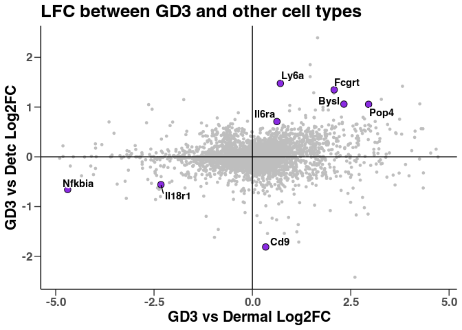

Extended Figure 5
================

Load R libraries

``` r
library(tidyverse)
library(ggrepel)

library(reticulate)
use_python("/projects/home/nealpsmith/.conda/envs/updated_pegasus/bin/python")
```

Load python packages

``` python
import os
import pegasus as pg
import scanpy as sc
import pandas as pd
import numpy as np
import scvelo as scv
import cellrank as cr
import seaborn as sns
import matplotlib.pyplot as plt
import warnings
warnings.filterwarnings('ignore')
```

Read in data

``` python
mouse_df = pg.read_input('/projects/home/ikernin/projects/sokol_cameron_sc/github_datasets/github_mouse_df.zarr')
```

``` python
detc_velocyto_df = sc.read_h5ad('/projects/home/ikernin/projects/sokol_cameron_sc/github_datasets/detc_res_0_5_no_cycling_velocyto.h5ad')
gd3_velocyto_df = sc.read_h5ad('/projects/home/ikernin/projects/sokol_cameron_sc/github_datasets/gd3_res_0_5_no_cycling_velocyto.h5ad')
```

## Extended Figure 5a

``` python
# get umap coords for base
umap_coords = pd.DataFrame(mouse_df.obsm['X_umap'], columns=['x', 'y'])
x = umap_coords['x']
y = umap_coords['y']
plot_df = pd.DataFrame(data={'x': x, 'y': y})

# set up figure structure
fig, ax = plt.subplots(figsize=(6.5, 5.5))

# get v-gene pair info of top 10 gd3 clones
gd3_df = mouse_df[mouse_df.obs['celltype'] == 'GD3']
gd3_top10_clones = gd3_df[gd3_df.obs['tcr_clone'] != ""].obs['tcr_clone'].value_counts().index[:10]
gd3_notnone = gd3_df[gd3_df.obs['tcr_clone'].isin(gd3_top10_clones)]
gd3_notnone_df = pd.DataFrame(gd3_notnone.obsm['X_umap'], columns=['x', 'y'])
gd3_notnone_df['clone'] = gd3_notnone.obs['v_clone'].values

# get v-gene pair info of top 10 DETC clones
detc_df = mouse_df[mouse_df.obs['celltype'] == 'DETC']
detc_top10_clones = detc_df[detc_df.obs['tcr_clone'] != ""].obs['tcr_clone'].value_counts().index[:10]
detc_notnone = detc_df[detc_df.obs['tcr_clone'].isin(detc_top10_clones)]
detc_notnone_df = pd.DataFrame(detc_notnone.obsm['X_umap'], columns=['x', 'y'])
detc_notnone_df['clone'] = detc_notnone.obs['v_clone'].values

# combine datasets for plotting
notnone_df = pd.concat([gd3_notnone_df, detc_notnone_df])
notnone_df['clone'] = notnone_df['clone'].astype('category')

# define colors for v-gene pairs
color_dict = {
    "TRGV4_TRDV2-2": '#F58020',
    "TRGV5_TRDV4": '#055593',
    "TRGV4_TRAV13-4-DV7": '#D3D535',
    "TRGV7_TRAV13-4-DV7": '#65499E',
    "TRGV6_TRAV13-4-DV7": '#1A9F74',
    "TRGV2_TRDV2-2": '#197B3D',
    "TRGV5_TRDV5": '#CC79A9',
    "TRGV6_TRDV5": '#9C1F5C'
}

# plot clone data point on top of non-clone data points
sns.scatterplot(data=plot_df, x='x', y='y', color='grey', edgecolor=None,
                    s=120000 / plot_df.shape[0], ax=ax)
sns.scatterplot(data=notnone_df, x='x', y='y', hue='clone', hue_order=list(color_dict.keys()), edgecolor=None,
                    palette=list(color_dict.values()),
                    s=120000 / plot_df.shape[0], ax=ax)

# format axes
ax.tick_params(left=False, labelleft=False,
                   bottom=False, labelbottom=False)
ax.set_title("Gene pairs of Top 10 GD3 and Detc Clones", fontsize=14)
ax.set_ylabel('UMAP2', fontsize=14)
ax.set_xlabel('UMAP1', fontsize=14)
plt.legend(title='V-Gene Pair', loc='upper right')
plt.show()
plt.close()
```


## Extended Figure 5b

``` python
# plot gd3 velocities
scv.tl.velocity(gd3_velocyto_df, mode="dynamical")
scv.tl.velocity_graph(gd3_velocyto_df)
scv.pl.velocity_embedding_stream(gd3_velocyto_df,
                                 color='#931A1D',
                                 legend_loc='right margin',
                                 smooth=0.8,
                                 min_mass=3,
                                 figsize=(7, 5),
                                 fontsize=16,
                                 arrow_size=1.5,
                                 linewidth=1.5,
                                 title='GD3',
                                 )

# plot DETC velocities
scv.tl.velocity(detc_velocyto_df, mode="dynamical")
scv.tl.velocity_graph(detc_velocyto_df)
scv.pl.velocity_embedding_stream(detc_velocyto_df,
                                 color='#005492',
                                 legend_loc='right margin',
                                 smooth=0.8,
                                 min_mass=3,
                                 figsize=(7, 5),
                                 fontsize=16,
                                 arrow_size=1.5,
                                 linewidth=1.5,
                                 title='DETC',
                                 )
```

    ## computing velocities
    ##     finished (0:00:03) --> added 
    ##     'velocity', velocity vectors for each individual cell (adata.layers)
    ## computing velocity graph (using 1/128 cores)
    ## WARNING: Unable to create progress bar. Consider installing `tqdm` as `pip install tqdm` and `ipywidgets` as `pip install ipywidgets`,
    ## or disable the progress bar using `show_progress_bar=False`.
    ##     finished (0:00:12) --> added 
    ##     'velocity_graph', sparse matrix with cosine correlations (adata.uns)
    ## computing velocity embedding
    ##     finished (0:00:04) --> added
    ##     'velocity_umap', embedded velocity vectors (adata.obsm)


    ## computing velocities
    ##     finished (0:00:03) --> added 
    ##     'velocity', velocity vectors for each individual cell (adata.layers)
    ## computing velocity graph (using 1/128 cores)
    ##     finished (0:00:05) --> added 
    ##     'velocity_graph', sparse matrix with cosine correlations (adata.uns)
    ## computing velocity embedding
    ##     finished (0:00:01) --> added
    ##     'velocity_umap', embedded velocity vectors (adata.obsm)


## Extended Figure 5c

``` python
# get initial and terminal states
cr.tl.terminal_states(gd3_velocyto_df, cluster_key='leiden_labels')
cr.tl.initial_states(gd3_velocyto_df, cluster_key="leiden_labels")

# compute for pseudotimes and lineages
cr.tl.lineages(gd3_velocyto_df)
scv.tl.recover_latent_time(gd3_velocyto_df,
                           root_key="initial_states_probs",
                           end_key="terminal_states_probs")

# compute DPT, starting from a cell in initial state
root_idx = np.where(gd3_velocyto_df.obs["initial_states"] == "3")[0][0]
gd3_velocyto_df.uns["iroot"] = root_idx
sc.tl.dpt(gd3_velocyto_df)


# plot heatmap of lineage drivers
lineage_drivers = cr.tl.lineage_drivers(gd3_velocyto_df)
gd3_model = cr.ul.models.GAM(gd3_velocyto_df)

os.chdir('/projects/home/ikernin/github_code/sokol_gdt/figure_scripts/extended_figure_5/extended_figure_5_files')
cr.pl.heatmap(
    gd3_velocyto_df,
    gd3_model,
    genes=gd3_velocyto_df.varm['terminal_lineage_drivers']["1_corr"].sort_values(ascending=False).index[:100],
    show_absorption_probabilities=False,
    lineages="1",
    n_jobs=1,
    backend="loky",
    save='gd3_no_cycling_lineage_drivers_heatmap.pdf'
)
```

<embed src="extended_figure_5_files/figures/gd3_no_cycling_lineage_drivers_heatmap.pdf" width="800px" height="460px" type="application/pdf" />

## Extended Figure 5d

``` python
# run detc vs gd3 DE analysis
pg.de_analysis(mouse_df,
               cluster='celltype',
               subset=['DETC', 'GD3'],
               de_key='de_detc_vs_gd3'
               )

# run dermal vs gd3 DE analysis
```

``` python
pg.de_analysis(mouse_df,
               cluster='celltype',
               subset=['Dermal', 'GD3'],
               de_key='de_dermal_vs_gd3'
               )

# get dataframes of DE results
```

``` python
gene_names = mouse_df.var_names
ensembl_id = mouse_df.var.featureid

de_detc_vs_gd3 = pd.DataFrame.from_records(mouse_df.varm['de_detc_vs_gd3'])
de_detc_vs_gd3['gene_name'] = gene_names
de_detc_vs_gd3.index = ensembl_id
de_detc_vs_gd3.to_csv('/projects/home/ikernin/projects/sokol_cameron_sc/github_datasets/de_full_detc_vs_gd3.csv')

de_dermal_vs_gd3 = pd.DataFrame.from_records(mouse_df.varm['de_dermal_vs_gd3'])
de_dermal_vs_gd3['gene_name'] = gene_names
de_dermal_vs_gd3.index = ensembl_id
de_dermal_vs_gd3.to_csv('/projects/home/ikernin/projects/sokol_cameron_sc/github_datasets/de_full_dermal_vs_gd3.csv')
```

``` r
# read in gd3 vs dermal DE results
gd3_vs_dermal <- read_csv('/projects/home/ikernin/projects/sokol_cameron_sc/github_datasets/de_full_dermal_vs_gd3.csv',
                             col_select = c('gene_name', 'GD3:log2FC'))
gd3_vs_dermal <- rename(gd3_vs_dermal, 'gd3_vs_dermal_log2FC' = 'GD3:log2FC')

#read in gd3 vs detc DE results
gd3_vs_detc <- read_csv('/projects/home/ikernin/projects/sokol_cameron_sc/github_datasets/de_full_detc_vs_gd3.csv',
                           col_select = c('gene_name', 'GD3:log2FC'))
gd3_vs_detc <- rename(gd3_vs_detc, 'gd3_vs_detc_log2FC' = 'GD3:log2FC')


# combine dataframes and remove extreme outliers for plotting
df <- inner_join(gd3_vs_dermal, gd3_vs_detc, by='gene_name') %>%
  filter(abs(gd3_vs_dermal_log2FC) < 5,
         abs(gd3_vs_detc_log2FC) < 5)


plot_select_genes <- function(genes, pt_size=3){
  plot_df <- df %>%
    mutate(case = gene_name %in% genes,
           genelabels = case_when(
             case ~ gene_name,
             TRUE ~ ""
           ))

  ggplot(plot_df, aes(x=gd3_vs_dermal_log2FC, y=gd3_vs_detc_log2FC)) +
    geom_point(data = plot_df %>% filter(!case), color = 'grey', size=1) +
    geom_point(data = plot_df %>% filter(case), pch=21, size=pt_size, fill = "blueviolet") +
    geom_text_repel(aes(label = genelabels),
                    max.overlaps = Inf,
                    color = "black",
                    bg.color = "white",
                    bg.r = .15) +
    geom_vline(xintercept = 0) +
    geom_hline(yintercept = 0) +
    theme_classic() +
    theme(legend.position="none",
          axis.ticks.length=unit(.25, "cm"),
          text = element_text(size = 16)) +
    labs(x = 'GD3 vs Dermal Log2FC',
         y = 'GD3 vs Detc Log2FC',
         title = 'LFC between GD3 and other cell types')
}


genes_to_highlight <- c('Cd9', 'Ly6a', 'Il6ra', 'Bysl', 'Fcgrt', 'Pop4', 'Il18r1', 'Nfkbia')
plot_select_genes(genes_to_highlight)
```

<!-- -->
