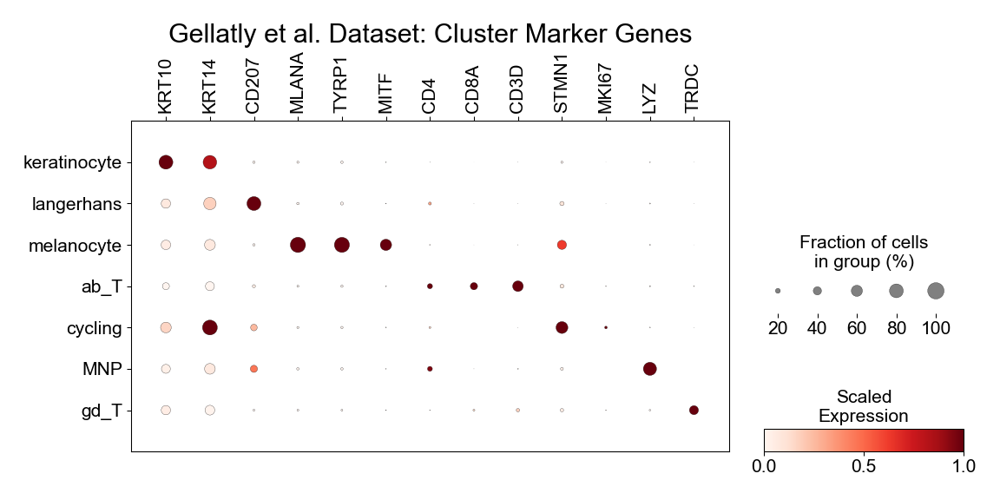
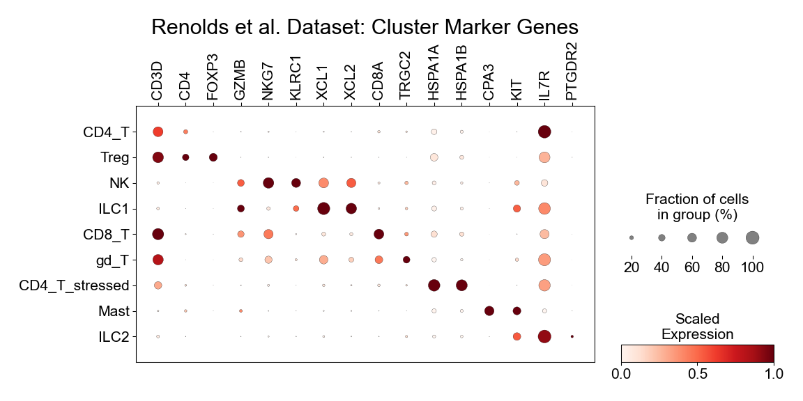
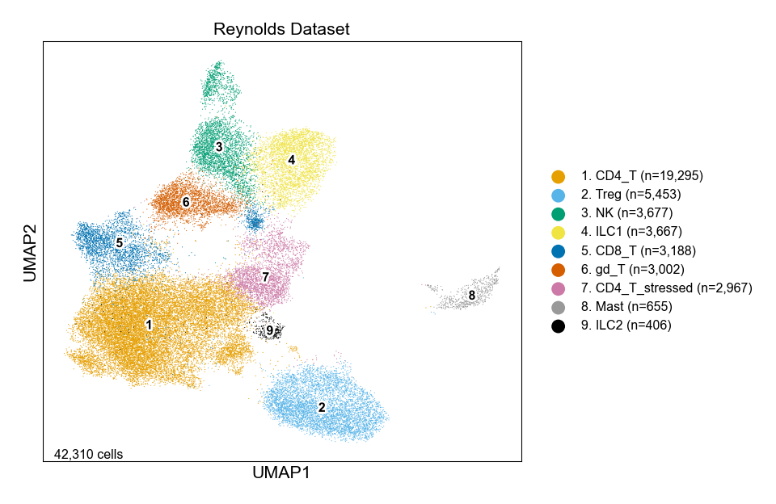
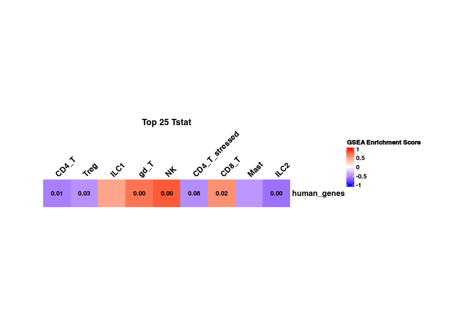
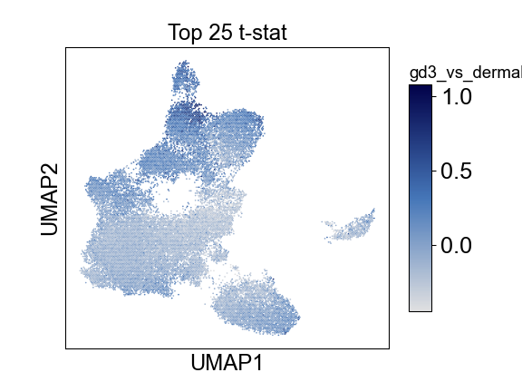

Extended Figure 7
================

## Set up

Load R libraries

``` r
library(tidyverse)

library(reticulate)
use_python("/projects/home/nealpsmith/.conda/envs/updated_pegasus/bin/python")

setwd('/projects/home/ikernin/github_code/sokol_gdt/functions')
source('r_functions.R')
```

Load python packages

``` python

import pegasus as pg
import scanpy as sc
import pandas as pd
import warnings
warnings.filterwarnings('ignore')

import sys
sys.path.append("/projects/home/ikernin/github_code/sokol_gdt/functions")
import python_functions
```

Read in data

``` python

gellatly_df = pg.read_input('/projects/home/ikernin/projects/sokol_cameron_sc/github_datasets/github_gellatly_df.zarr')
```

``` python
reynolds_df = pg.read_input('/projects/home/ikernin/projects/sokol_cameron_sc/github_datasets/github_reynolds_df.zarr')
```

## Extended Figure 7a

``` python
# genes to display in gellatly dotplot
gellatly_genes = ["KRT10", "KRT14", "CD207", "MLANA", "TYRP1", "MITF",
                  "CD4", "CD8A", "CD3D", "STMN1", "MKI67", "LYZ", "TRDC"]

python_functions.make_dotplot(gellatly_df.to_anndata(),
             cluster_order=["keratinocyte",
                            "langerhans",
                            "melanocyte",
                            "ab_T",
                            "cycling",
                            "MNP",
                            "gd_T"],
             gene_order=gellatly_genes,
             obs_name_col='celltype_name',
             title='Gellatly et al. Dataset'
             )
```



## Extended Figure 7b

``` python
# genes to display in reynolds dotplot
reynolds_genes = ["CD3D", "CD4", "FOXP3", "GZMB", "NKG7", 'KLRC1', 'XCL1', 'XCL2',
              "CD8A", "TRGC2", "HSPA1A", "HSPA1B", "CPA3", "KIT", "IL7R", "PTGDR2"]
python_functions.make_dotplot(reynolds_df.to_anndata(),
             cluster_order=["CD4_T",
                            "Treg",
                            "NK",
                            "ILC1",
                            "CD8_T",
                            "gd_T",
                            "CD4_T_stressed",
                            "Mast",
                            "ILC2"],
             gene_order=reynolds_genes,
             obs_name_col='celltype_name',
             title='Renolds et al. Dataset')
```



## Extended Figure 7c

``` python
# plot Reynolds umap with cell type annotations
python_functions.plot_umap(reynolds_df,
          title='Reynolds Dataset',
          colors=["#E69F00", "#56B4E9", "#009E73", "#F0E442", "#0072B2", "#D55E00", "#CC79A7", "#999999", "#000000"],
          cluster_col='celltype_name',
          fig_size=(5, 5),
          wspace=0.8,
          marker_multiplier=15,
          cluster_font_size=12,
          axis_font_size=16,
    show=True
          )
```



## Extended Figure 7d

``` r
# read in cluster one-vs-all de results
reynolds_pb_df <- read_pseudobulk_res('/projects/home/ikernin/projects/sokol_cameron_sc/github_datasets/reynolds_pb_by_lineage_pseudobulk_pvals.csv')

# read in gd3 geneset (from figure 2h code)
top25_tstat_gd3_vs_dermal_genesets <- read_csv('/projects/home/ikernin/projects/sokol_cameron_sc/github_datasets/top25_tstat_gd3_vs_dermal_genesets.csv')

# run gsea
reynolds_gd3_vs_dermal_gsea <- get_gsea_res(reynolds_pb_df,
                                            top25_tstat_gd3_vs_dermal_genesets %>% select(human_genes) %>% drop_na() %>% data.frame() %>% as.list(), 
                                            '/projects/home/ikernin/projects/sokol_cameron_sc/github_datasets/reynolds_gd3_vs_dermal')
```

    ## cluster: 1
    ## cluster: 2
    ## cluster: 3
    ## cluster: 4
    ## cluster: 5
    ## cluster: 6
    ## cluster: 7
    ## cluster: 8
    ## cluster: 9

``` r
# format cluster names
reynolds_gd3_vs_dermal_gsea <- reynolds_gd3_vs_dermal_gsea %>%
  mutate(
    cluster_number = cluster,
    cluster = case_when(
    cluster_number == 1 ~ "CD4_T",
    cluster_number == 2 ~ "Treg",
    cluster_number == 3 ~ "ILC1",
    cluster_number == 4 ~ "gd_T",
    cluster_number == 5 ~ "NK",
    cluster_number == 6 ~ "CD4_T_stressed",
    cluster_number == 7 ~ "CD8_T",
    cluster_number == 8 ~ "Mast",
    cluster_number == 9 ~ "ILC2"
  ))

# plot heatmap
ht <- plot_gsea_heatmap(reynolds_gd3_vs_dermal_gsea)
draw(ht)
```

<!-- -->

## Extended Figure 7e

``` python
# read in gd3 geneset (from figure 2h code)
gd3_vs_dermal_gene_sets = pd.read_csv("/projects/home/ikernin/projects/sokol_cameron_sc/github_datasets/top25_tstat_gd3_vs_dermal_genesets.csv")

# get averge z-score of genes in gd3 geneset
python_functions.signature_score_per_cell(reynolds_df,
gd3_vs_dermal_gene_sets['human_genes'].dropna(),
                           'gd3_vs_dermal_top_25_tstat_genes')

# plot hexbins in UMAP space
python_functions.hex_plot(reynolds_df,
         'Top 25 t-stat',
         'gd3_vs_dermal_top_25_tstat_genes',
         gridsize=200,
         cmap=python_functions.blues_cmap
         )
```

    ## 23/23 of the gene set genes are measured


