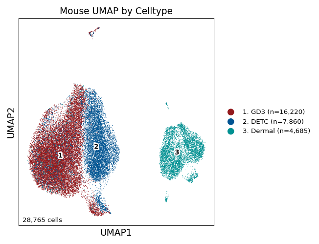
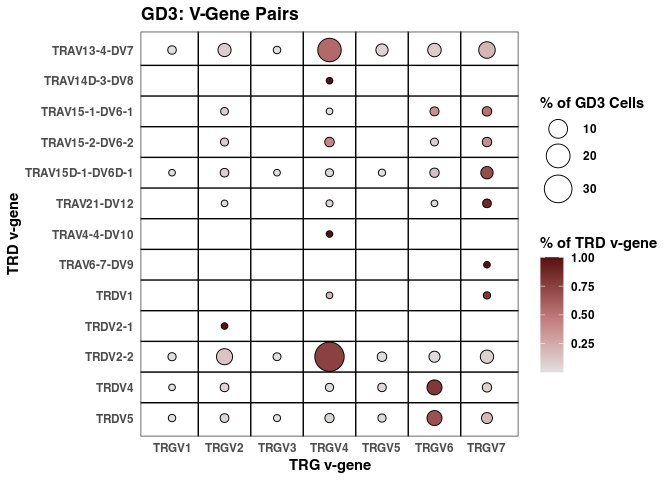
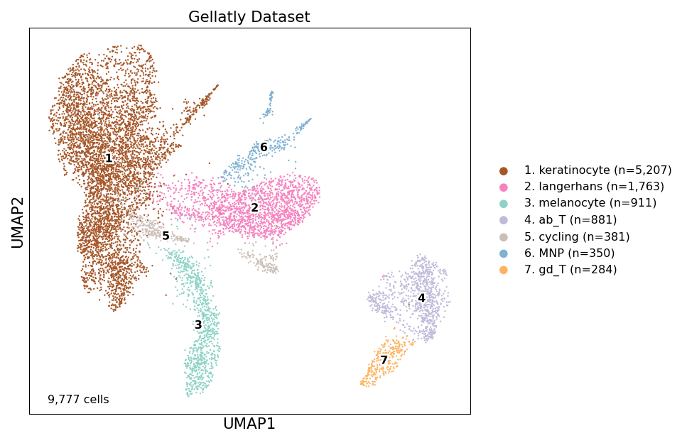
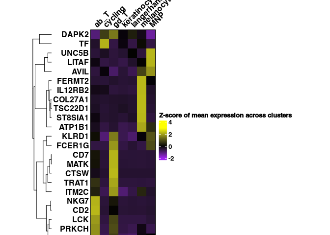
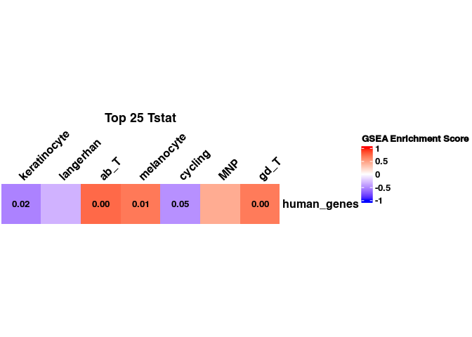
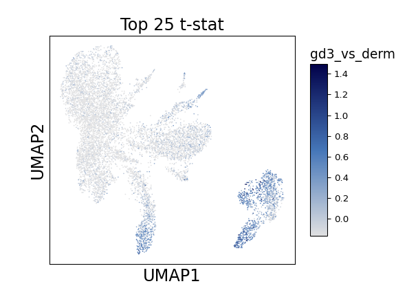

Figure 2
================

## Set up

Load R libraries

``` r
library(tidyverse)

library(reticulate)
use_python("/projects/home/nealpsmith/.conda/envs/updated_pegasus/bin/python")

setwd('/projects/home/ikernin/github_code/sokol_gdt/functions')
source('r_functions.R')
```

Load python packages

``` python

import pegasus as pg
import scanpy as sc
import pandas as pd
import warnings
warnings.filterwarnings('ignore')

import sys
sys.path.append("/projects/home/ikernin/github_code/sokol_gdt/functions")
import python_functions
```

Read in data

``` python

mouse_df = pg.read_input('/projects/home/ikernin/projects/sokol_cameron_sc/github_datasets/github_mouse_df.zarr')
```

``` python
gellatly_df = pg.read_input('/projects/home/ikernin/projects/sokol_cameron_sc/github_datasets/github_gellatly_df.zarr')
```

## Figure 2a

``` python

# plot mouse UMAP by celltype
python_functions.plot_umap(mouse_df,
                   'Mouse UMAP by Celltype',
                   ['#931A1D', '#005492', '#009192'],
                   cluster_col='celltype',
                   fig_size=(4, 4),
                   marker_multiplier=10,
                   cluster_font_size=10,
                   axis_font_size=14,
                   wspace=0.5,
                   simple=False,
                   show=True
                   )
```



## Figure 2b

``` r
# read in tcr information per celltype
gd3_df <- read_csv('/projects/home/ikernin/projects/sokol_cameron_sc/github_datasets/gd3_2umi_tcr.csv',
          show_col_types = FALSE)
detc_df <- read_csv('/projects/home/ikernin/projects/sokol_cameron_sc/github_datasets/detc_2umi_tcr.csv',
          show_col_types = FALSE)

# get v-gene pair info for each clone
gd3_clone_df <- gd3_df %>%
  select(TRD_v_gene, TRG_v_gene) %>%
  drop_na(TRD_v_gene, TRG_v_gene) %>%
  mutate(v_clone = str_c(TRD_v_gene, TRG_v_gene, sep = '_'))

# get percentages of v-gene pairings
vpair_perc <- gd3_clone_df %>%
  group_by(TRD_v_gene, TRG_v_gene) %>%
  summarize(n_pair = n()) %>%
  ungroup() %>%
  mutate(perc_pair = n_pair/ sum(n_pair) * 100)

# get the abundance of TRDV genes
n_trdv <- gd3_clone_df %>%
  group_by(TRD_v_gene) %>%
  summarize(n_trdv = n())

# add get v-pair as a percentage of TCD v-gene information
plot_df <- vpair_perc %>%
  left_join(n_trdv, by = 'TRD_v_gene') %>%
  mutate(perc_trdv = n_pair/n_trdv) %>%
  mutate(TRD_v_gene = factor(TRD_v_gene),
         TRG_v_gene = factor(TRG_v_gene),
         TRD_v_gene = factor(TRD_v_gene, levels = rev(levels(TRD_v_gene))))


# create bubble plot
ggplot(plot_df, aes(x = TRG_v_gene, y = TRD_v_gene, size = perc_pair, fill = perc_trdv)) +
  geom_point(color='black', pch=21) +
  scale_size(range=c(2,10)) +
  geom_vline(xintercept=seq(1.5, length(unique(gd3_clone_df$TRG_v_gene))-0.5, 1),
             lwd=.5, colour="black") +
  geom_hline(yintercept=seq(1.5, length(unique(gd3_clone_df$TRD_v_gene))-0.5, 1),
             lwd=.5, colour="black") +
  scale_fill_gradient2(low = "#e0e0e1", mid='#be7577', high = "#580f11", midpoint = 0.5) +
  theme_bw() +
  theme(axis.ticks = element_blank(),
        panel.grid.major = element_blank(),
        panel.grid.minor = element_blank(),
        legend.position = 'right') +
  guides(size = guide_legend(order = 1)) +
  labs(title = 'GD3: V-Gene Pairs',
       x = 'TRG v-gene',
       y = 'TRD v-gene',
       fill = '% of TRD v-gene',
       size = '% of GD3 Cells')
```

<!-- -->

## Figure 2g

``` python

# plot Gellatly UMAP by cell type
python_functions.plot_umap(gellatly_df,
          title='Gellatly Dataset',
          colors=['#a65628', '#f781bf', '#8dd3c7', '#bebada',
                  '#cbbeb5', '#80b1d3', '#fdb462'],
          cluster_col="celltype_name",
          fig_size=(5, 5),
          wspace=0.8,
          marker_multiplier=5,
          cluster_font_size=12,
          axis_font_size=16,
          show=True
          )
```



## Figure 2h

``` python

# get mouse GD3 vs Dermal DE results
subset_df = mouse_df[mouse_df.obs['celltype'].isin(['Dermal', 'GD3'])].copy()
subset_df.obs['gd3_vs_dermal'] = subset_df.obs['celltype']
subset_df.obs['gd3_vs_dermal'] = subset_df.obs['gd3_vs_dermal'].cat.remove_unused_categories()

pg.de_analysis(subset_df, cluster='gd3_vs_dermal', de_key='gd3_vs_dermal_de_res', t=True)
```

``` python
gd3_vs_dermal_de_res = pd.DataFrame.from_records(subset_df.varm['gd3_vs_dermal_de_res'])
gd3_vs_dermal_de_res.index = subset_df.var_names
gd3_vs_dermal_de_res.to_csv("/projects/home/ikernin/projects/sokol_cameron_sc/github_datasets/gd3_vs_dermal_de_res.csv")
```

``` r
# read in mouse to human mart
mouse_to_human <- read_csv('/projects/home/ikernin/projects/sokol_cameron_sc/github_datasets/mouse_to_human_mart.csv')

read_de_res <- function(de_path, name_start){
  # read in DE results
  read_csv(de_path) %>%
    dplyr::select(featurekey, starts_with(name_start)) %>%
    rename_with(~str_remove(.x, paste0(name_start, ":"))) %>%
    rename('gene_name' = 'featurekey') %>%
    dplyr::select(gene_name, t_tstat)
}


get_top25_tstat <- function(de_res){
  # get top 25 genes by t-statistic (excluding TCR genes)
  top_25_mouse <- de_res %>%
    dplyr::select(gene_name, t_tstat) %>%
    filter(!grepl('^Tr[abgd][vj]', gene_name)) %>% # remove tcr genes
    arrange(desc(t_tstat)) %>%
    head(25) %>%
    select(gene_name)

  # convert mouse genes to their human homologs
  top_25_human <- top_25_mouse %>%
    dplyr::left_join(mouse_to_human,
              by = c('gene_name' = 'mgi_symbol'),
              multiple = 'all') %>%
    drop_na(hsapiens_homolog_associated_gene_name) %>%
    pull(hsapiens_homolog_associated_gene_name)

  gd3_geneset <- tibble(mouse_genes = top_25_mouse$gene_name,
                        human_genes = append(top_25_human,
                                             rep(NA,
                                                 (length(top_25_mouse$gene_name) - length(top_25_human))
                                                 )
                                             )
                        )
  return(gd3_geneset)
}


gd3_vs_dermal_de_res <- read_de_res('/projects/home/ikernin/projects/sokol_cameron_sc/github_datasets/gd3_vs_dermal_de_res.csv', 'GD3')
top25_tstat_gd3_vs_dermal_genesets <- get_top25_tstat(gd3_vs_dermal_de_res)
write_csv(top25_tstat_gd3_vs_dermal_genesets, '/projects/home/ikernin/projects/sokol_cameron_sc/github_datasets/top25_tstat_gd3_vs_dermal_genesets.csv', na = "")
```

``` python

# read in gd3 gene set
gd3_vs_dermal_gene_sets = pd.read_csv("/projects/home/ikernin/projects/sokol_cameron_sc/github_datasets/top25_tstat_gd3_vs_dermal_genesets.csv")

# get mean expression values from scanpy for R heatmap
fig = sc.pl.dotplot(gellatly_df.to_anndata(),
                    gd3_vs_dermal_gene_sets['human_genes'].dropna(),
                    groupby='celltype_name',
                    return_fig=True)
gellatly_dotplot_colors = fig.__dict__['dot_color_df']
gellatly_dotplot_colors.to_csv('/projects/home/ikernin/projects/sokol_cameron_sc/github_datasets/gellatly_gd3_geneset_mean_expression.csv')
```

``` r
# read in gellatly gd3 geneset mean expression
gellatly_gd3_mean_exp <- read_csv('/projects/home/ikernin/projects/sokol_cameron_sc/github_datasets/gellatly_gd3_geneset_mean_expression.csv')
gellatly_gd3_mean_exp <- gellatly_gd3_mean_exp %>%
  mutate(celltype_name = factor(celltype_name)) %>%
  arrange(celltype_name)


# create heatmap body matrix
mtx <- gellatly_gd3_mean_exp %>%
    select(!celltype_name) %>%
    as.matrix()
rownames(mtx) <- gellatly_gd3_mean_exp$celltype_name
mtx <- scale(mtx)

# define cell color range
heatmap_col_fun <- colorRamp2(c(floor(min(mtx)), 0, ceiling(max(mtx))),
                                c("purple", "black", "yellow"))

# make heatmap
mtx <- t(mtx)
ht <- Heatmap(mtx,
                col = heatmap_col_fun,
                name = 'Z-score of mean expression across clusters',
                cluster_columns = FALSE,  column_names_side = "top",
                show_column_names = T, column_names_rot = 45,
                cluster_rows = T, row_names_side = "left",
                row_title_rot = 0,
                row_title_gp=gpar(fontface='bold'),
                column_title_gp=gpar(fontface='bold'),
                border = TRUE,
                width = ncol(mtx)*unit(5, "mm"),
                height = nrow(mtx)*unit(5, "mm"))
draw(ht)
```

<!-- -->

## Figure 2i

``` r
# read in cluster one-vs-all de results
gellatly_pb_df <- read_pseudobulk_res('/projects/home/ikernin/projects/sokol_cameron_sc/github_datasets/gellatly_pb_by_lineage_pseudobulk_pvals.csv')

# run gsea
gellatly_gd3_vs_dermal_gsea <- get_gsea_res(gellatly_pb_df,
                                            top25_tstat_gd3_vs_dermal_genesets %>% select(human_genes) %>% drop_na() %>% data.frame() %>% as.list(), 
                                            '/projects/home/ikernin/projects/sokol_cameron_sc/github_datasets/gellatly_gd3_vs_dermal')
```

    ## cluster: 1
    ## cluster: 2
    ## cluster: 3
    ## cluster: 4
    ## cluster: 5
    ## cluster: 6
    ## cluster: 7

``` r
# format cluster names
gellatly_gd3_vs_dermal_gsea <- gellatly_gd3_vs_dermal_gsea %>%
  mutate(
    cluster_number = cluster,
    cluster = case_when(
    cluster_number == 1 ~ "keratinocyte",
    cluster_number == 2 ~ "langerhan",
    cluster_number == 3 ~ "ab_T",
    cluster_number == 4 ~ "melanocyte",
    cluster_number == 5 ~ "cycling",
    cluster_number == 6 ~ "MNP",
    cluster_number == 7 ~ "gd_T"
  ))

# plot heatmap
ht <- plot_gsea_heatmap(gellatly_gd3_vs_dermal_gsea)
draw(ht)
```

<!-- -->

## Figure 2j

``` python
# get averge z-score of genes in gd3 geneset
python_functions.signature_score_per_cell(gellatly_df,
gd3_vs_dermal_gene_sets['human_genes'].dropna(),
                           'gd3_vs_dermal_top_25_tstat_genes')
# plot hexbins in UMAP space
python_functions.hex_plot(gellatly_df,
         'Top 25 t-stat',
         'gd3_vs_dermal_top_25_tstat_genes',
         gridsize=200,
         cmap=python_functions.blues_cmap
         )
```

    ## 23/23 of the gene set genes are measured


